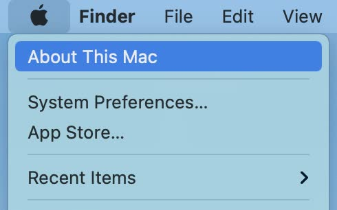
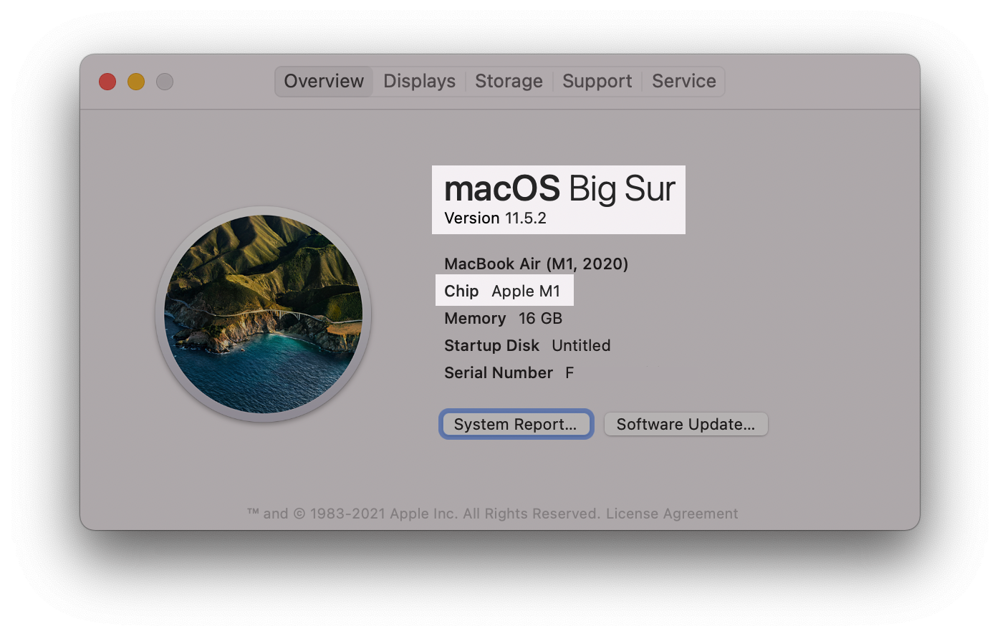
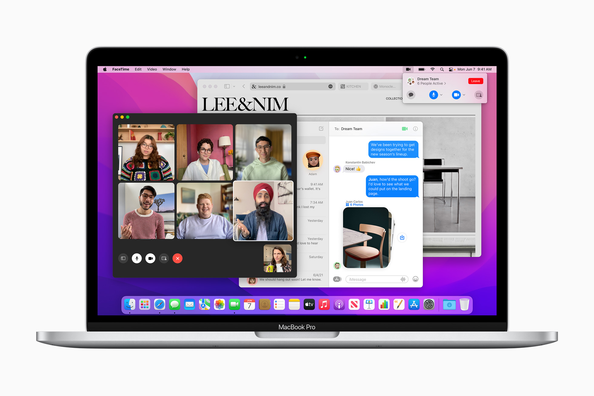
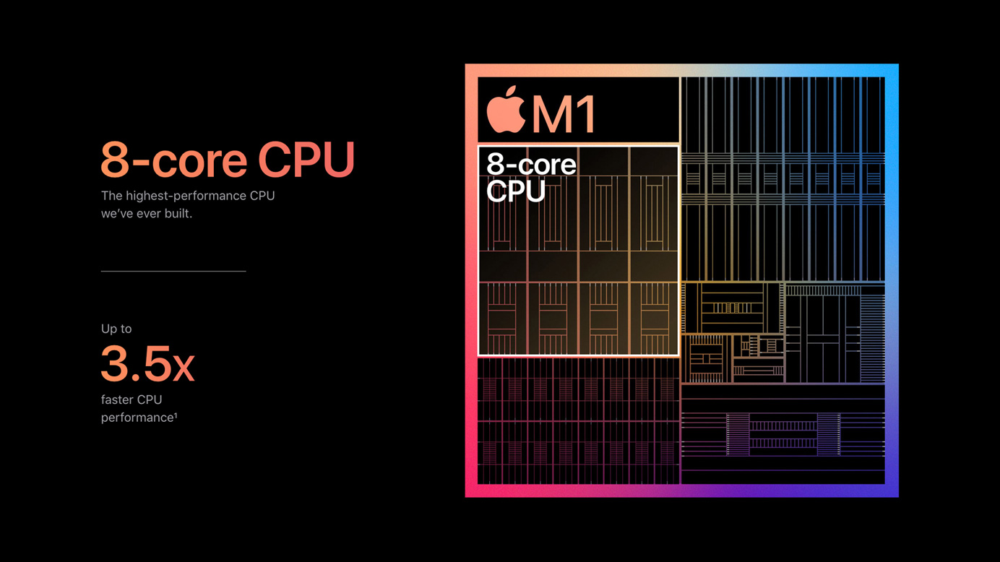

# Mac 개요

Mac은 다 비슷하게 생겼기 때문에 겉모습으로는 어떤 모델(연식)인지 알 수 없습니다. 지금 사용하는 Mac이 언제 만들어졌는지, CPU와 메모리 구성을 알고 싶다면 화면의 왼쪽 상단 모서리에 있는 `Apple 메뉴()`에서 `About This Mac(이 Mac에 관하여)`을 선택합니다.

개발 환경에서 중요한 건 `macOS 버전`과 CPU가 `Intel`인지 `Apple Silicon`인지 확인하는 것입니다.

MacBook Air(2020) / Big Sur / Apple Silicon(M1)

> Apple Silicon이 탑재된 Mac은 화면에 `Chip(칩)` 항목이 나타나고, 이어서 모델명이 표시됩니다.

iMac(2020) / Big Sur / Intel

MacBook Pro(2019) / Monterey / Intel

**다양한 Mac 기기**

- 노트북 - MacBook Air, MacBook Pro
- 데스크톱 - Mac mini, Mac Pro
- 일체형 - iMac, iMac Pro

## macOS

macOS(맥 오에스)는 Apple이 개발한 Mac 컴퓨터의 기본 운영 체제Operating System입니다. Apple이 하드웨어(Mac)와 소프트웨어(macOS)를 둘다 만들기 때문에 시스템이 안정적이고 사용자 경험이 좋습니다.

유닉스Unix 계열의 운영체제로 터미널이 강력하고 개발에 적합한 생태계를 제공합니다. Windows 또한 좋은 개발환경을 제공하지만 macOS에 비해 개발 환경을 구축하는데 시간이 더 걸리거나 번거로운 경우가 많습니다.

Windows를 사용하다가 처음 macOS를 접하면 "이쁜데 불편하다"고 느낄 수 있습니다. 기본기능을 익히고 개발환경을 구축한 다음, 추천 앱을 사용하면서 점점 친숙해져 봅시다.

### OS 버전

간단하게 macOS의 역사를 알아봅니다. ~~안물안궁이면 패스~~

mac의 초기 운영 체제 이름은 `Macintosh System`이었고 이후 Mac OS 8, 9처럼 `Mac OS` + `숫자`를 사용하다가 10이 되면서 `Mac OS X(맥 오에스 텐)`~~엑스아님~~을 사용했습니다. 이후 Mac을 빼고 `OS X`를 사용하다가 최근에는 `macOS`를 사용하고 있습니다. `OS X`에서 `macOS`로 바뀐 지 얼마 안 되었기 때문에 많은 곳에서 `OS X`과 `macOS`를 혼용해서 사용합니다.

2021년 현재 최신 버전은 `macOS Monterey`이고, 2020년에 Apple Silicon을 지원하는 `macOS Big Sur`가 출시되었습니다. 보통 1년 주기로 메이저 버전이 업데이트되고 무료로 제공합니다.

::: details OS 버전 히스토리
| macOS | 버전 | 릴리즈 |
| --------------------- | ----- | ---- |
| macOS Monterey(beta) | 12 | 2021 |
| macOS Big Sur | 11 | 2020 |
| macOS Catalina | 10.15 | 2019 |
| macOS Mojave | 10.14 | 2018 |
| macOS High Sierra | 10.13 | 2017 |
| macOS Sierra | 10.12 | 2016 |
| OS X El Capitan | 10.11 | 2015 |
| OS X Yosemite | 10.10 | 2014 |
| OS X Mavericks | 10.9 | 2013 |
| OS X Mountain Lion | 10.8 | 2012 |
| OS X Lion | 10.7 | 2011 |
| Mac OS X Snow Leopard | 10.6 | 2009 |
| Mac OS X Leopard | 10.5 | 2007 |
| Mac OS X Tiger | 10.4 | 2005 |
| Mac OS X Panther | 10.3 | 2003 |
| Mac OS X Jaguar | 10.2 | 2002 |
| Mac OS X Puma | 10.1 | 2001 |
| Mac OS X Cheetah | 10.0 | 2001 |
:::

## Apple Silicon (M1)

Apple은 지난 2020년 11월 Intel을 버리고 M1을 탑재한 MacBook Air, 13형 MacBook Pro 및 Mac mini를 발표했습니다. Apple이 제작한 역대 가장 강력한 칩인 M1은 기존 Mac보다 💰저렴하지만, ⚡️더 빠르고, ❄️발열도 적고, 🔋베터리도 더 오래가는 초초초 사기급의 성능을 보여주고 있습니다.

CPU 아키텍처가 변경되었지만, Rosetta 2 에뮬레이터를 이용하여 기존 Intel 기반 앱들도 대부분 문제없이 동작하며 성능상의 차이도 거의 느낄 수 없습니다. 유명한 앱들이 발 빠르게 Apple Silicon 용으로 빌드한 앱을 내놓았기 때문에 대부분 새로운 Mac에 최적화된 앱을 사용할 수 있습니다.
